<h1 align="center">Hi 👋, I'm Suraj Yadav</h1>
<h3 align="center">Software Engineer: Bridging Vision and Reality</h3>

  

 
   

- 💬 Ask me about **Flutter , NODE JS  , Python  , Linux , Ubuntu Touch, QML**
- 📫 How to reach me **surajyadav200701@gmail.com**
- ⚡ Fun fact **HP, Microsoft, and Apple all started in garages.**

<h3 align="left">Connect with me:</h3>

<table>
  <tr>
    <td></td>
    <td></td>
    <td></td>
    <td></td>
    <td></td>
  </tr>
</table>

<h3 align="left">Languages and Tools:</h3>

<table>
  <tr>
    <td></td>
    <td></td>
    <td></td>
    <td></td>
    <td></td>
    <td></td>
    <td></td>
    <td></td>
  </tr>
  <tr>
    <td></td>
    <td></td>
    <td></td>
    <td></td>
    <td></td>
    <td></td>
    <td></td>
    <td></td>
  </tr>
  <tr>
    <td></td>
    <td></td>
    <td></td>
    <td></td>
    <td></td>
    <td></td>
    <td></td>
    <td></td>
  </tr>
  <tr>
    <td></td>
    <td></td>
    <td></td>
    <td></td>
    <td></td>
    <td></td>
    <td></td>
    <td></td>
  </tr>
</table>

  
  

